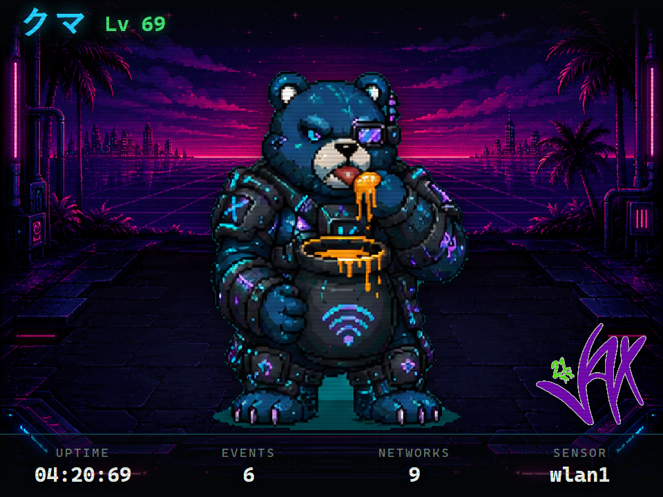
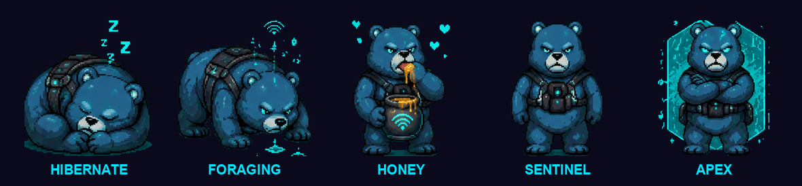
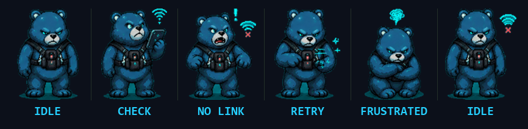
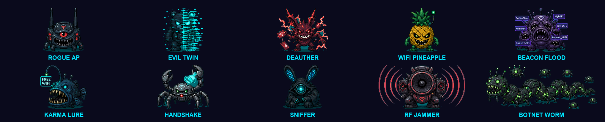
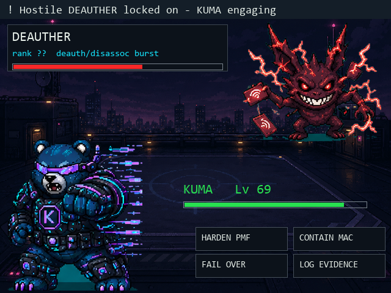

# クマ

KUMA. An open-source, DIY, blue-team Wi-Fi defense gadget.

Pwnagotchi, [Bjorn](https://github.com/infinition/Bjorn), [HashMonster](https://github.com/G4lile0/ESP32-WiFi-Hash-Monster), and [Bruce](https://github.com/pr3y/Bruce) are pocket tools built for attacking wireless networks. KUMA starts from the other side: it sits on the network you want to protect, watches the air for those attacks, scores what it sees, and shows it on a dashboard with a pixel-bear mascot whose mood tracks the threat. **Blue-team first** — by default it is detection and defense only, and in that default posture never transmits attack frames.

It *also* ships an opt-in, heavily-gated offensive tier — **Kuroshuna** — for actively testing the resilience of a lab you own. That capability is off by default and **may only be used lawfully against equipment you own or are explicitly authorized to test**. See [Offensive capability](#offensive-capability--kuroshuna-authorized-lab-use-only) below before you go near it.

Five modes: Hibernate (conserve), Foraging (discover), Sentinel (detect), Honey (deceive), Apex (respond).

Built from parts you can buy. No custom PCB, no sealed product. Ugly and working first.



> The T-Deck face mid-attack: a deauth burst detected, threat HIGH, bear on alert. Composed from the device's actual embedded sprites and cyber-space background at native 320x240.

## The face

KUMA's mood *is* the UI. Each mode wears a different face; an attack flips it to alert and arms countermeasures.



Lose the link to the Pi and the bear paces the screen hunting for a signal:



### The threats it knows

Every live detector maps to an on-device "enemy" you can engage from the alert screen:



### Battle: engage the threat

When an attack lands, KUMA drops into an on-device battle against the matching enemy — the engagement screen for the response.



> KUMA squares off against a detected DEAUTHER. Composed from the device's embedded sprites and battle background at 2x the native 320x240. (Wiring the countermeasure moves to real mitigation is in progress.)

## Status

Live on hardware. KUMA runs as an autonomous sensor on a Raspberry Pi under systemd and arms itself on boot. The whole path works on real attack traffic, proven by catching a live WiFi Pineapple deauth flood: 1640 frames in ten seconds, threat HIGH, bear on alert, all on the dashboard.

The pipeline:

```
802.11 frame (monitor mode) -> detector -> scoring -> SQLite -> HTTP API -> dashboard / handheld
```

Detectors running live (details in [docs/detection-logic.md](docs/detection-logic.md)):

- deauth and disassoc bursts
- beacon and SSID floods
- rogue access points
- evil twins, caught by security downgrade
- karma and PineAP probe response
- EAPOL handshake harvesting

Apex Mode adds gated, automated defense: harden PMF, fail over to a backup link, or hand the attacker MAC to a managed controller for containment. It is defensive only and off by default. KUMA never sends deauth or jamming frames.

Beacon fingerprinting, which catches a clone that spoofs the real BSSID exactly, also exists but ships opt-in. On a real multi-radio router it false-alarms, so it stays off until the scoring is rebuilt. The detection doc has the honest writeup.

For development, `KUMA_MOCK=1` runs the entire pipeline with no Wi-Fi hardware.

## Offensive capability — Kuroshuna (authorized lab use only)

> **⚠️ READ THIS BEFORE ENABLING ANYTHING.**
> The Kuroshuna tier makes KUMA *transmit real attacks*: targeted Wi-Fi
> deauthentication, WPA handshake capture, multi-protocol credential brute-forcing
> (SSH / FTP / SMB / RDP / Telnet / SQL), file exfiltration, and broadcast
> deauth / beacon / BLE flooding.
>
> **These actions are lawful ONLY against networks and devices you personally own,
> or for which you hold explicit, documented authorization to test.** Deauthing,
> brute-forcing, intercepting, or jamming equipment you do not own is a crime in
> most jurisdictions — including the U.S. Computer Fraud and Abuse Act (18 U.S.C.
> § 1030), the U.S. Wiretap Act, the UK Computer Misuse Act 1990, and equivalents
> worldwide — and can carry serious criminal and civil penalties. Radio jamming /
> deauth flooding is separately illegal under FCC rules and their international
> counterparts.
>
> **Broadcast attacks are indiscriminate** and cannot be contained by software; only
> physical RF isolation (low power, distance, or a shielded/attenuated setup) keeps
> them off bystanders' equipment. Running them outside such isolation will hit gear
> you do not own.
>
> **You are solely and entirely responsible for how you use this.** It is provided
> for authorized security research and active self-defense of your own lab. The
> authors disclaim all liability for any misuse. If you are not certain a target is
> yours or authorized in writing, **do not arm this.**

KUMA's default posture is unchanged — passive blue-team. Kuroshuna is the opt-in
"gloves off" tier for proving your own defenses hold and for active self-defense in a
lab. It is built to be hard to fire by accident and impossible to point off-scope:

- **Off by default, multiply gated.** Nothing transmits unless `lab_mode` *and* a
  deliberate on-device arm are set. Every single action is checked against one
  authorization gate and written to an append-only audit log.
- **Scoped to your targets.** Targeted offense only acts on an explicit
  `approved_targets` allowlist, or on attackers confirmed to be hitting your own
  protected APs. Your own infrastructure is hard-denied, always — it cannot be
  targeted even by mistake.
- **Broadcast is double-armed and time-boxed.** The indiscriminate flood/spam tier
  needs a *second*, separate broadcast arm, auto-stops on a timer, and is pinned to a
  single channel at capped power.
- **The handheld asks first.** The T-Deck's own-radio deauth authorizes every shot
  with the Pi gate before transmitting; a refusal means nothing is sent.

It is armed only from the device terminal (`kuroshuna arm` → explicit confirm; the
broadcast tier requires a stricter second confirm). Full design and gating model:
[the Kuroshuna spec](docs/superpowers/specs/2026-06-09-kuroshuna-offensive-mode-design.md).

## Hardware

| Part | Role |
|------|------|
| Raspberry Pi 4 or 5 | The brain. Backend, capture, detection, scoring, SQLite, API. |
| USB Wi-Fi dongle, monitor capable | The ears. Live packet capture. A TP-Link WN722N works well. |
| LilyGo T-Deck or M5Stack Core | The face. Pixel-bear UI that polls the Pi. Does no capture itself. |

Details in [docs/hardware-current.md](docs/hardware-current.md).

## Architecture

```
[ T-Deck / M5Core ]              the FACE (ESP32)
  bear UI, mode select, alerts
        |  HTTP (JSON)
[ Raspberry Pi ]                 the BRAIN (Python, FastAPI, SQLite)
  mode engine, detectors, scoring, event log, API
        |
[ USB dongle, monitor mode ]     the EARS
```

More in [docs/architecture.md](docs/architecture.md).

## Quickstart (no hardware, mock mode)

```bash
cd backend
python3 -m venv .venv && source .venv/bin/activate   # Windows: .venv\Scripts\activate
pip install -r requirements.txt
uvicorn kuma_api.app:app --host 0.0.0.0 --port 8080
```

Then:

```bash
curl http://localhost:8080/api/status     # mode, threat_level, bear_state, event count
curl http://localhost:8080/api/events     # recent events
curl -X POST http://localhost:8080/api/mode -H 'Content-Type: application/json' -d '{"mode":"foraging"}'
# interactive docs at http://localhost:8080/docs
# dashboard at http://localhost:8080/
```

Run the tests:

```bash
cd backend && pip install -r requirements-dev.txt && pytest -q
```

## Firmware

PlatformIO projects under [`firmware/`](firmware/). The T-Deck build (`firmware/tdeck-ui/`) is the current handheld face. Set your Wi-Fi and the Pi address in `include/config.h`, then `pio run -t upload`.

## Design

The look is locked in [DESIGN.md](DESIGN.md): a dark, monospace instrument console, the Akakabuto bear, and a blacklist of AI-template patterns so nothing drifts into slop. Five dashboard directions to choose from live in [`designs/`](designs/).

## Docs

- [architecture.md](docs/architecture.md), system and data flow
- [hardware-current.md](docs/hardware-current.md), the current stack
- [modes.md](docs/modes.md), the five bear modes
- [api.md](docs/api.md), the HTTP API contract
- [detection-logic.md](docs/detection-logic.md), what is detected and how it is scored
- [prior-art.md](docs/prior-art.md), what we took from Bjorn, Pwnagotchi, HashMonster, Bruce
- [build-log.md](docs/build-log.md), running notes on what works and what does not
- [ROADMAP.md](ROADMAP.md), the plan

## Rules

1. If it does not work on a desk, it does not deserve a pocket.
2. Confidence scored, never absolute. Every detection says "suspected." MACs can be spoofed, so we never overclaim attribution.
3. Defense is the default; offense is opt-in, gated, and lawful-use-only. The passive blue-team build never transmits attack frames. The Kuroshuna offensive tier (deauth, credential testing, broadcast simulation) stays off behind `lab_mode` + a deliberate arm + an approved-target allowlist, and may be used **only** against equipment you own or are explicitly authorized to test. See [Offensive capability](#offensive-capability--kuroshuna-authorized-lab-use-only).

## Scope

KUMA is a defensive tool for networks you own or are authorized to monitor. Its optional Kuroshuna offensive tier transmits real attacks and may be used **only** against equipment you own or are explicitly, documentably authorized to test — see [Offensive capability](#offensive-capability--kuroshuna-authorized-lab-use-only) for the full legal warning. Unauthorized use is illegal and entirely your responsibility. Use it lawfully or not at all.

## License

[MIT](LICENSE), 2026 Jax. Patterns mirrored from the MIT-licensed prior art (Bjorn, HashMonster). Architecture inspiration only, no code, from the GPL and AGPL projects (Pwnagotchi, Bruce).
